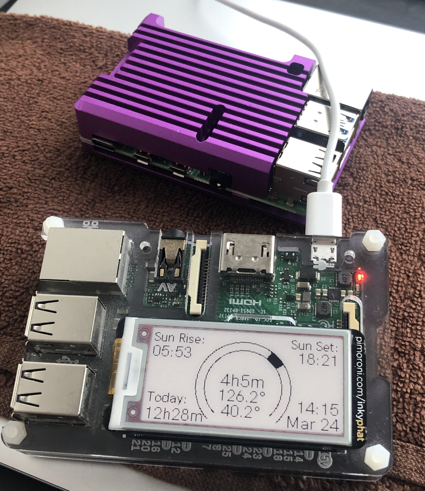

# SunsetTracker
Track the day's progress and time to sunset using the [Pimoroni InkyPhat](https://shop.pimoroni.com/products/inky-phat)

- It take a long 2 or 3 seconds to render the InkyPhat display making development slow.
- With a bit of hacking you can simulate the InkyPhat inside a jupyter notebook.
- This made it quick and easy to learn how to use the Python Image Library "PIL"
- Working example in `sunset_timer.ipynb`

## getting started
- install the Inky-Phat, run the examples know that it's working.
- running  `sunrise.py` opens the ``sunrise2020.csv`` reads the sunrise/set times and renders the InkyPhat.

## looks good on your desktop

## improvments
- [ ] explain how to generate your own sunrise sunset times from [timeanddate.com](https://www.timeanddate.com/sun/uk/london?month=1&year=2020)
- [ ] Use API to fetch sunrise/sunset for your location
- [ ] tidy the code a lot.
- [ ] better explanations of how it works

## References
- https://learn.pimoroni.com/tutorial/sandyj/getting-started-with-inky-phat
- https://github.com/pimoroni/inky
- https://shop.pimoroni.com/products/inky-phat

## snippets
Convert a jupyter notebook to python script
`jupyter nbconvert --to script <your notebook>.ipynb --output <your new scriptfile.py`
